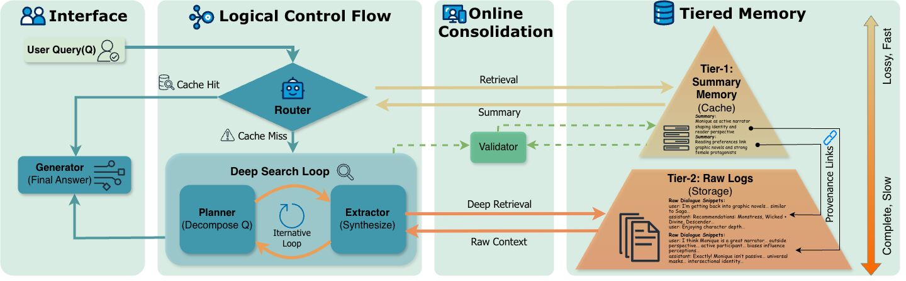

# TierMem: Tiered Memory System

A memory-augmented LLM system for long-context question answering with intelligent routing between summary-based and raw-retrieval pipelines.

## Overview

TierMem implements a two-tier memory architecture:
1. **Summary Index (S-path)**: Fast semantic search over extracted facts using Mem0
2. **Page Store (R-path)**: Raw conversation chunks with BM25 retrieval for detailed context

A trained router model dynamically selects between these paths based on query complexity.

## Architecture




## Installation

### Prerequisites

- Python 3.10+
- Qdrant vector database
- CUDA-capable GPU (for router training)

### Setup

```bash
# Clone the repository
git clone https://github.com/your-org/TierMem.git
cd TierMem

# Install dependencies
pip install -r requirements.txt

# Start Qdrant
./start_qdrant.sh

# Set environment variables
export OPENAI_API_KEY=your_key_here
export OPENAI_BASE_URL=your_base_url  # Optional
```

## Quick Start

### Running Benchmarks

```bash
# LoCoMo benchmark (concurrent execution)
python test_TierMem_locomo_multi.py --limit 10 --max-workers 4

# LongMemEval benchmark
python test_TierMem_longmemeval_multi.py --limit 10 --max-workers 4

# MemoryAgentBench
python test_TierMem_memoryagentbench.py \
  --split Accurate_Retrieval \
  --limit 10 \
  --max-workers 4
```

### Common Parameters

| Parameter | Description | Default |
|-----------|-------------|---------|
| `--limit N` | Process only N sessions | All |
| `--max-workers N` | Number of concurrent workers | 4 |
| `--model MODEL` | LLM model name | gpt-4.1-mini |
| `--run-id ID` | Custom run identifier | auto |

## Project Structure

```
TierMem/
├── core/                           # Benchmark framework
│   ├── systems/                   # Memory system interfaces
│   ├── datasets/                  # Dataset loaders (LoCoMo, LongMemEval, etc.)
│   └── runner/                    # Evaluation runners
├── src/                           # System implementations
│   ├── memory/                   # Memory system implementations
│   ├── linked_view/              # TierMem architecture components
│   ├── evaluation/               # LLM-as-Judge evaluation
│   └── mem0/                     # Modified mem0 library
├── scripts/
│   └── router_training/          # Router model training pipeline
├── test_TierMem_*.py             # Benchmark runner scripts
└── start_qdrant.sh               # Qdrant startup script
```

## Router Training

The router model determines which retrieval path (Summary or Raw) to use for each query.

### Training Pipeline

1. **Build Offline Dataset**
   ```bash
   python scripts/router_training/1_build_offline_dataset.py
   ```

2. **Prepare SFT Data**
   ```bash
   python scripts/router_training/2_prepare_sft_data_v2.py
   ```

3. **Supervised Fine-Tuning (SFT)**
   ```bash
   sbatch scripts/router_training/train_router_sft.sbatch
   ```

4. **GRPO Training** (Optional, for further optimization)
   ```bash
   sbatch scripts/router_training/train_router_grpo.sbatch
   ```

5. **Deploy Router with vLLM**
   ```bash
   sbatch scripts/router_training/start_router_vllm.sbatch
   ```

### Configuration

Update the following placeholders in sbatch scripts:
- `<PROJECT_ROOT>`: Path to your TierMem installation
- `<MS_SWIFT_DIR>`: Path to ms-swift installation

## Supported Benchmarks

| Benchmark | Description | Metrics |
|-----------|-------------|---------|
| LoCoMo | Long-context memory QA | F1, Accuracy |
| LongMemEval | Long memory evaluation | F1, Accuracy |
| MemoryAgentBench | Multi-split agent benchmark | F1, Accuracy |
| HotPotQA | Multi-hop QA | F1, EM |
| HaluMem | Hallucination evaluation | Accuracy |

## Results

Results are saved to `results/{benchmark}/{system_name}/{run_id}/`:

```
results/locomo/linked_view/my_run/
├── sessions/
│   ├── conv-1_write.jsonl
│   ├── conv-1_qa.jsonl
│   └── ...
├── summary.json              # Aggregated metrics
└── eval_details.json         # Detailed evaluation
```

## Configuration

### Environment Variables

| Variable | Description | Required |
|----------|-------------|----------|
| `OPENAI_API_KEY` | OpenAI API key | Yes |
| `OPENAI_BASE_URL` | Custom API endpoint | No |
| `QDRANT_HOST` | Qdrant server host | No (default: localhost) |
| `QDRANT_PORT` | Qdrant server port | No (default: 6333) |

## Citation

If you use TierMem in your research, please cite:


```

## License

This project is licensed under the MIT License - see the LICENSE file for details.

## Acknowledgments

- [Mem0](https://github.com/mem0ai/mem0) for memory management
- [ms-swift](https://github.com/modelscope/swift) for model training
- [vLLM](https://github.com/vllm-project/vllm) for efficient inference
