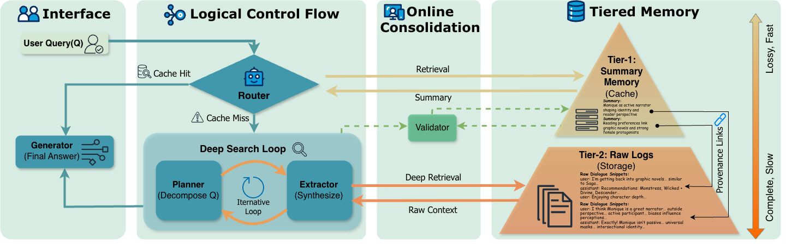

<div align="center">

# TierMem: Balancing Compressed Memory and Raw Evidence for Long-Horizon Agent Memory

[](https://openreview.net/forum?id=svKCa4itcd)
[](https://www.python.org/downloads/)
[](https://opensource.org/licenses/MIT)
[](https://huggingface.co/FreedomIntelligence/TierMem)
[](https://arxiv.org/abs/2602.17913)

Qiming Zhu · Shunian Chen · Rui Yu · Zhehao Wu · Benyou Wang

**Accepted at COLM 2026 🎉**

**Start with compact memory. Recover the details when they matter.**

[Paper / OpenReview](https://openreview.net/forum?id=svKCa4itcd) · [Earlier preprint](https://arxiv.org/abs/2602.17913) · [Model](https://huggingface.co/FreedomIntelligence/TierMem) · [Citation](#citation)

[Use cases](#when-this-helps) · [Results](#results) · [Quick start](#quick-start) · [Training](#router-training)

</div>

## News

- **2026-07-08** — Celebrating TierMem's acceptance at **COLM 2026** 🎉 We've refreshed the title and results, and added a walkthrough of memory use during a long debugging session below.
- **2026-02-20** — The first preprint appeared on [arXiv](https://arxiv.org/abs/2602.17913).

The earlier preprint is titled *From Lossy to Verified: A Provenance-Aware Tiered Memory for Agents*. Follow the [OpenReview record](https://openreview.net/forum?id=svKCa4itcd) for the conference paper and updates.

## Table of Contents

- [Overview](#overview)
- [When This Helps](#when-this-helps)
- [Key Features](#key-features)
- [Architecture](#architecture)
- [Results](#results)
- [Installation](#installation)
- [Model](#model)
- [Quick Start](#quick-start)
- [Project Structure](#project-structure)
- [Router Training](#router-training)
- [Supported Benchmarks](#supported-benchmarks)
- [Evaluation Outputs](#evaluation-outputs)
- [Configuration](#configuration)
- [Citation](#citation)
- [Contributing](#contributing)
- [License](#license)
- [Acknowledgments](#acknowledgments)

## Overview

A long-running agent needs both a useful working memory and a way to recover earlier details. A compact note might remember that a decision was made, while a later question needs the exact constraint, timestamp, or observation behind it. Those future questions are unknown when the note is written.

TierMem stores experience at two linked levels:

1. **Tier-1: compact memory.** Summaries and extracted facts provide a fast retrieval path. Each entry keeps links to its source pages.
2. **Tier-2: raw evidence.** Original interaction pages preserve details that compact memory may omit.

For each query, a learned router checks whether the retrieved compact memory contains enough evidence to answer. If it does, TierMem answers directly. Otherwise, it follows the source links to raw pages and performs bounded additional retrieval when needed. Recovered facts can then be consolidated into compact memory with their source links preserved.

The decision is **whether the available evidence is sufficient for this question**. Even a short question can require an exact detail that the summary left out.

## When This Helps

We are interested in tasks where the same history is revisited for different reasons:

| Setting | What compact memory can retain | What a later question may require |
|---|---|---|
| Long debugging sessions | The current plan, recent changes, and attempted fixes | The exact test output or earlier constraint behind a change |
| Research across many documents | Findings, working hypotheses, and source pointers | An exact quotation, number, or methodological detail |
| Assistants spanning multiple sessions | Preferences, plans, and recent updates | When a preference changed or which exception applied |

### A long debugging session

*An illustrative walkthrough with fictional messages and tool output.*

An agent has been investigating a slow callback. After several rounds of work, its compact memory says:

> The callback timeout was increased to 60 seconds after testing the slow path.

That note points to the original history, which includes:

```text
[page-012 · user]
The slow callback can take around 45 seconds. Keep callback retries capped at 2.

[page-018 · test output]
test_slow_callback, timeout=30s: FAIL — callback arrived after 43.2s.
test_slow_callback, timeout=60s: PASS.
```

Hours later, the next question determines how much of that history is needed:

| Later question | Expected memory access |
|---|---|
| "What timeout did we settle on?" | Answer **60 seconds** from compact memory. |
| "Why did 30 seconds fail? Which test showed it?" | Follow the note's source link to `page-018` and recover the test name and **43.2-second** observation. |
| "Can we just increase the retry count?" | Retrieve the earlier constraint from `page-012`: retries were explicitly capped at **2**. |

After recovering the test evidence, consolidation can enrich the note with the observed delay and its source, making a repeated question cheaper to answer. This is the behavior we want to explore in long-running agents. The paper evaluates the memory mechanisms on **LoCoMo and LongMemEval conversational memory benchmarks**.

## Key Features

- **Sufficiency routing:** a trained Qwen3-0.6B router selects compact or raw evidence for each query.
- **Source-linked retrieval:** compact memories point back to the raw pages that support them.
- **Bounded escalation:** additional retrieval can fill remaining evidence gaps within a fixed search budget.
- **Evidence-backed consolidation:** recovered details can update compact memory while retaining their provenance. The paper studies consolidation through updates between evaluation epochs.
- **Evaluation tooling:** benchmark runners record answer quality, routing, token use, and latency.

## Architecture

<div align="center">
  
  <p><em>Compact memory first; source-linked raw evidence when the query needs more detail.</em></p>
</div>

## Installation

### Prerequisites

- Python 3.10+
- A running Qdrant vector database
- An API endpoint for answer generation and embeddings
- A served router for the default LoCoMo and LongMemEval configurations (see [Model](#model))
- CUDA-capable GPU (for router training)

### Setup

```bash
# Clone the repository
git clone https://github.com/FreedomIntelligence/Tiermem.git
cd Tiermem

# Install dependencies
pip install -r requirements.txt

# Start Qdrant if its binary is installed locally or on PATH
./start_qdrant.sh

# Set environment variables
export OPENAI_API_KEY=your_key_here
export OPENAI_BASE_URL=your_base_url  # Optional
```

## Model

Our trained router is available on Hugging Face:

<div align="center">

[](https://huggingface.co/FreedomIntelligence/TierMem)

**Download:** `https://huggingface.co/FreedomIntelligence/TierMem`

</div>

The router decides whether the query can be answered from the retrieved summaries (**S**) or needs raw evidence (**R**).

The LoCoMo and LongMemEval runners default to a vLLM router at `http://localhost:8000/v1`, with the served model name `Qwen3-0.6B`. Prepare the router endpoint before running them, and use `--router-base-url` and `--router-model` to match your deployment.

---

## Quick Start

### Running Benchmarks

Once the services and dataset paths are configured, start with a small run. The [dataset loaders](core/datasets/) contain the dataset locations and loading options.

**LoCoMo Benchmark** (Concurrent Execution)
```bash
python test_TierMem_locomo_multi.py --limit 10 --max-workers 4
```

**LongMemEval Benchmark**
```bash
python test_TierMem_longmemeval_multi.py --limit 10 --max-workers 4
```

**MemoryAgentBench**
```bash
python test_TierMem_memoryagentbench.py \
  --split Accurate_Retrieval \
  --limit 10 \
  --max-workers 4
```

### Common Parameters

| Parameter | Description | Default |
|-----------|-------------|---------|
| `--limit N` | Process only N sessions | All sessions for LoCoMo/LongMemEval; 2 for MemoryAgentBench |
| `--max-workers N` | Number of concurrent workers | 1 / 50 / 2 for LoCoMo / LongMemEval / MemoryAgentBench |
| `--model MODEL` | LLM model name | `gpt-4.1-mini` |
| `--run-id ID` | Custom run identifier | auto-generated |

> **Tip:** Start with a small `--limit` value to test your setup before running full benchmarks.

## Project Structure

```
TierMem/
├── core/                           # Benchmark framework
│   ├── systems/                   # Memory system interfaces
│   ├── datasets/                  # Dataset loaders (LoCoMo, LongMemEval, etc.)
│   └── runner/                    # Evaluation runners
├── src/                           # System implementations
│   ├── memory/                   # Memory system implementations
│   ├── linked_view/              # TierMem architecture components
│   ├── evaluation/               # LLM-as-Judge evaluation
│   └── mem0/                     # Modified mem0 library
├── scripts/
│   └── router_training/          # Router model training pipeline
├── test_TierMem_*.py             # Benchmark runner scripts
└── start_qdrant.sh               # Qdrant startup script
```

## Router Training

The paper trains the Qwen3-0.6B router with supervised fine-tuning followed by GRPO. **Appendix D of our COLM 2026 camera-ready manuscript** ([OpenReview record](https://openreview.net/forum?id=svKCa4itcd)) documents the labels, prompts, reward, and training hyperparameters.

The repository includes these preparation and evaluation tools:

| Resource | Purpose |
|---|---|
| [Build offline data](scripts/router_training/1_build_offline_dataset.py) | Combine existing summary-path and raw-path evaluation outputs into paired training records |
| [Prepare SFT data](scripts/router_training/2_prepare_sft_data_v2.py) | Format distilled routing examples for supervised fine-tuning |
| [Prepare GRPO data](scripts/router_training/3_prepare_grpo_data.py) | Construct the routing dataset for policy optimization |
| [Routing reward](scripts/router_training/plugin/router_reward.py) | Reward implementation for router training |
| [Evaluate the router](scripts/router_training/5_eval_router_online.py) | Evaluate routing decisions online |

Use each script's argument definitions to configure input and output paths. Training and serving launch commands depend on your environment; the optional training dependencies are listed in [requirements.txt](requirements.txt).

---

## Supported Benchmarks

The paper reports results on LoCoMo and LongMemEval. The repository also includes a MemoryAgentBench runner for further experiments.

| Benchmark | Coverage | Runner |
|---|---|---|
| **LoCoMo** | Main paper evaluation | [LoCoMo runner](test_TierMem_locomo_multi.py) |
| **LongMemEval** | Main paper evaluation | [LongMemEval runner](test_TierMem_longmemeval_multi.py) |
| **MemoryAgentBench** | Additional experimental runner | [MemoryAgentBench runner](test_TierMem_memoryagentbench.py) |

---

## Evaluation Outputs

Results are saved to `results/{benchmark}/{system_name}/{run_id}/`:

```
results/locomo/linked_view/my_run/
├── sessions/
│   ├── conv-1_write.jsonl
│   ├── conv-1_qa.jsonl
│   └── ...
├── summary.json              # Aggregated metrics
└── eval_details.json         # Detailed evaluation
```

## Configuration

### Environment Variables

| Variable | Description | Required |
|----------|-------------|----------|
| `OPENAI_API_KEY` | OpenAI API key | Yes |
| `OPENAI_BASE_URL` | Custom API endpoint | No |

For LoCoMo and LongMemEval, configure Qdrant with `--qdrant-host` (default `localhost`) and `--qdrant-port` (default `6333`).

## Citation

For now, the citation below refers to the **earlier arXiv preprint**. We'll add the official COLM 2026 BibTeX after confirming the final citation metadata on [OpenReview](https://openreview.net/forum?id=svKCa4itcd).

```bibtex
@misc{zhu2026lossyverifiedprovenanceawaretiered,
  title         = {From Lossy to Verified: A Provenance-Aware Tiered Memory for Agents},
  author        = {Qiming Zhu and Shunian Chen and Rui Yu and Zhehao Wu and Benyou Wang},
  year          = {2026},
  eprint        = {2602.17913},
  archivePrefix = {arXiv},
  primaryClass  = {cs.DB},
  url           = {https://arxiv.org/abs/2602.17913}
}
```

---

## Contributing

Trying TierMem on your own agent history? We'd like to hear which details your summaries kept, which ones went missing, and whether reopening the source helped. Small examples are especially useful.

- For a bug, include the command, configuration, and relevant log excerpt in an [issue](https://github.com/FreedomIntelligence/Tiermem/issues).
- For an experiment, share the dataset, generator/router settings, and accuracy, token, and latency measurements.
- Documentation fixes and clearer setup instructions are welcome. See [CONTRIBUTING.md](CONTRIBUTING.md) for contribution details.

## License

This project is licensed under the **MIT License** - see the [LICENSE](LICENSE) file for details.

You are free to use, modify, and distribute this software for both commercial and non-commercial purposes.

## Acknowledgments

This project builds on excellent open-source work:

- [**Mem0**](https://github.com/mem0ai/mem0) - Memory management and semantic extraction
- [**ms-swift**](https://github.com/modelscope/swift) - Efficient model training framework
- [**vLLM**](https://github.com/vllm-project/vllm) - High-performance LLM inference
- [**Qdrant**](https://github.com/qdrant/qdrant) - Vector similarity search engine

---

<div align="center">

Maintained by the FreedomIntelligence team. Thanks for reading, trying the code, and sharing what you find.

</div>
